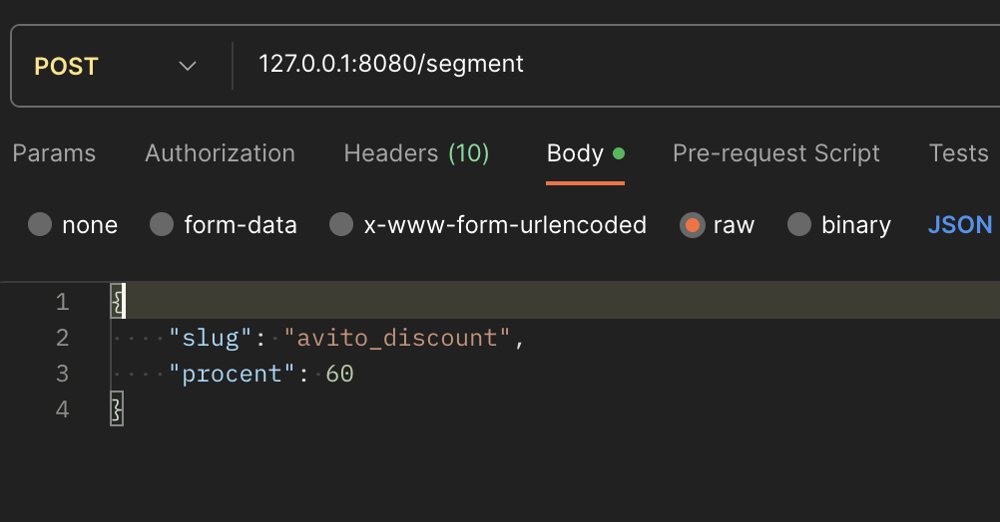
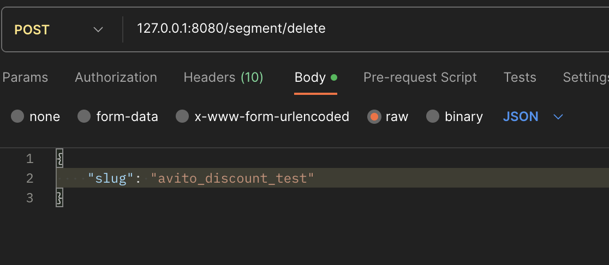
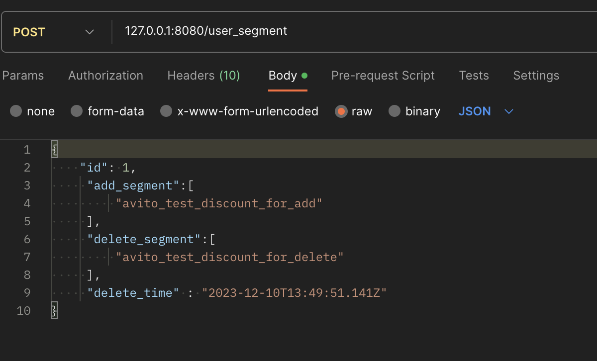
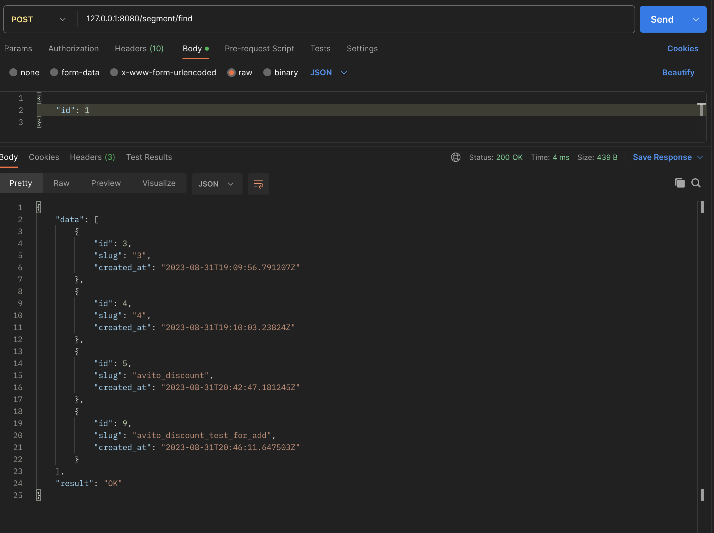

# Avito_backend_go

 

## Contents
1. [Описание методов](#описание-методов) \
    1.1. [Метод создания сегмента](#метод-создания-сегмента)  
    1.2. [Метод удаления сегмента](#метод-удаления-сегмента)  
    1.3. [Метод добавления пользователя в сегмент](#метод-добавления-пользователя-в-сегмент)  
    1.4. [Метод получения активных сегментов пользователя](#метод-получения-активных-сегментов-пользователя)
2. [Комментарии](#комментарии)
    
 

# Описание методов

## Метод создания сегмента. 
Принимает slug (название) сегмента. 

Метод POST  : /segment

`json:"slug"`  - название сегмента (string)
`json:"procent"`  - процент автоматического добавление юзеров в этот сегмент (int)

## Метод удаления сегмента. 
Принимает slug (название) сегмента.

Метод POST  : /segment/delete

`json:"slug"`  - название сегмента (string)

## Метод добавления пользователя в сегмент. 
Принимает список slug (названий) сегментов
 которые нужно добавить пользователю, список slug (названий) сегментов которые нужно удалить у пользователя, id пользователя.

Метод POST : /user_segment

 `json:"id"`  - id юзера которому добавляем/удаляем (int)
 `json:"add_segment"` - массив строк названий сегментов которые добавляем  пользователю ([]sting)
 `json:"delete_segment"` - массив строк названий сегментов которые удаляем у пользователя ([]sting)
 `json:"delete_time"` - время удаления юзера из сегмента. (timestamp)

## Метод получения активных сегментов пользователя. 
Принимает на вход id пользователя.

Метод POST : /segment/find

 `json:"id"` (int)

# Комментарии

Реализованы 2 и 3 дополнительные задания.

Существует три таблицы:
table  users 

    id - serial 
    created_at TIMESTAMP 

table  segments

     id SERIAL
     slug VARCHAR
     deleted INT 
     created_at TIMESTAMP

table user_segments

    user_id INT
    segment_id INT
    added_at TIMESTAMP
    delete_time TIMESTAMP

Физического удаления сегментов и юзер сегментов нет, посчитал возможным реализовать софт делит (удаление из таблиц опасно и не выгодно для аналитиков), в таблице Segments есть флаг deleted отвечающий за обозначение удалена она или нет, 0 - существует, 1 - удалена, соответственно в select запросах проверяется, при удалении ставится флаг в int значение.

В таблице user segments проверка на актуальность реализованна через сравнение столбца delete_time с настоящим временем, соответственно, при установке заранее времени delete_time, мы без лишних операций сможем узнать является ли актуальным user segment

В запросе на внесение процента юзеров в сегмент используется транзацкций, соответственно при не отработке одной из частей мы не выполним внесение в таблицу segments.

